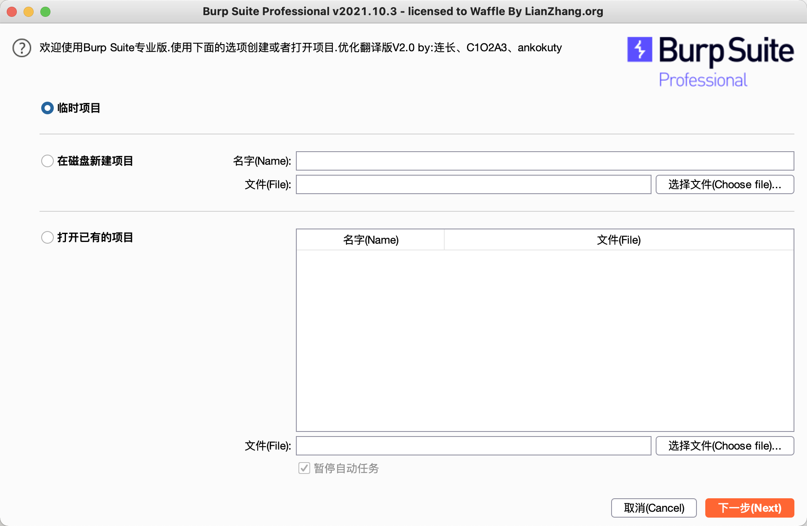

# Mac Burp Suite Crack

> 适用于dmg 安装包安装的Burp Suite

汉化包
https://github.com/funkyoummp/BurpSuiteCn

#### 2022.01.08 Update
2021.12 版本支持了为M1架构优化的安装包 稍稍有些改变

新增了Python3 Crack 脚本 支持2021.12 以及之前的版本

原bash脚本 仍然可用不过仅支持2021.12 之前的版本

 

上图为 实测M1